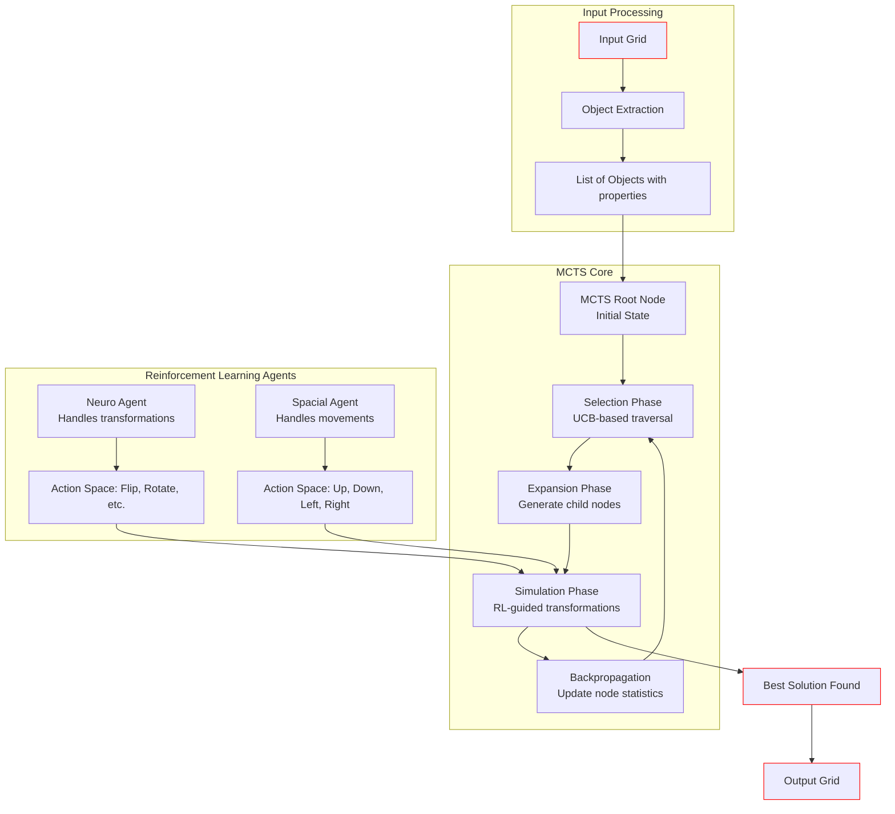

# ARC Prize 2025 – Neuro-Symbolic Solver

This project is focused on solving tasks from the [ARC (Abstraction and Reasoning Corpus)](https://github.com/fchollet/ARC) using a combination of **symbolic algorithms** (like A*, BFS, DSLs) and **neural models**, integrating them in a neuro-symbolic framework. The goal is to develop systems that generalize from few examples and mimic human-like reasoning.

## 🧠 Project Structure

| File | Description |
|------|-------------|
| `dsl.py`, `helper.py` | my dsl implementations & helper code |
| `arc_prize_soln.py`| Soln using Neural model combined with MCTS for task planning |
| `dl_models/neurosymbolic_reinforce.py` | Torch-based neural-symbolic integration |
| `dl_models/RL_A2C.py` | Torch-based neural-symbolic ,updatation using RL_A2C |
| `dl_models/q_learning.py` | Torch-based neural-symbolic ,updatation using q-learning (greedy-epsilon) |
| `Trash.py` | Scratch or deprecated experiments |
| `IDEAS.md` | Notes and brainstorming for models and approaches |
| `.gitignore` | Standard Git ignore rules |
| `README.md` | This file |

# **Architecture**

    
## Input Processing

This initial stage is responsible for deconstructing the input grid into a more manageable format: a list of distinct objects.

### **A: Input Grid**

* **Role:** This is the starting state of the puzzle, a 2D array of numbers representing colors.
* **In the Code:** This corresponds to the `a` variable within the main execution loop, which is an element from the loaded JSON data (`train[case_id]['train'][i]['input']`). It's passed as the `input_grid` argument to the `find_soln_using_mcts` function.

### **B: Object Extraction**

* **Role:** This component analyzes the `Input Grid` and identifies all connected shapes or "objects." It separates them from the background.
* **In the Code:** This is handled by the `find_objects(input_grid)` function call inside `find_soln_using_mcts`. This function (defined in `dsl.py`) likely uses an algorithm like flood fill to find contiguous areas of non-background colors and extracts them.

### **C: List of Objects with properties**

* **Role:** The output of the extraction process. It's a list where each element represents a single object and contains its properties, such as its shape (`grid`), color, size, and original position.
* **In the Code:** This is the `objects` variable returned by `find_objects`. This list is then used to initialize the MCTS search by being passed to the `MCTSNode` constructor.

---

## MCTS Core

This is the central search algorithm that intelligently explores the vast space of possible object arrangements to find the best solution.

### **D: MCTS Root Node**

* **Role:** The starting point of the search tree. It represents the initial state of the problem: a blank output grid and a list of all objects that need to be placed.
* **In the Code:** `root = MCTSNode(objects, np.zeros_like(output_grid), background)`. A new `MCTSNode` instance is created with the full list of extracted `objects`, an empty grid of the target size, and a determined background color.

### **E: Selection Phase**

* **Role:** Starting from the root, the algorithm traverses the tree by repeatedly selecting the most promising child node until it reaches a leaf node (a node that hasn't been expanded yet). The "promise" of a node is calculated using the UCB1 formula, which balances exploiting nodes with high rewards (`total_score / visits`) and exploring less-visited nodes.
* **In the Code:** The `while node.children:` loop inside `find_soln_using_mcts`. The selection logic `node = max(node.children, key=lambda n: n.ucb_score())` perfectly implements this UCB-based traversal.

### **F: Expansion Phase**

* **Role:** Once a leaf node is selected, it's "expanded" by creating new child nodes representing possible next moves. In this system, a move consists of placing one of the available objects onto the grid.
* **In the Code:** This is performed by the `node.expand()` method call. The `MCTSNode.expand` method iterates through unplaced objects and creates new child nodes by placing each object at various valid positions on the grid.

### **G: Simulation Phase**

* **Role:** This is the core of the "intelligent" search. From a newly expanded node, a simulation is run to estimate how good that move was. Instead of random moves, this simulation uses the RL agents to apply transformations (rotate, flip) and movements (up, down) to the objects in the current arrangement, trying to make the grid look more like the target. The quality of the final arrangement is returned as a score or reward.
* **In the Code:** This phase is executed by `node.simulate(neuro, spacial, output_grid)`. Inside this method, the `neuro` and `spacial` agents are called in loops to select actions (`select_action`). The reward is calculated based on the change in `matrix_similarity` between the current grid and the target grid. The agents' experiences (state, action, reward, next_state) are also stored here for later training (`store_experience`).

### **H: Backpropagation**

* **Role:** The reward obtained from the simulation is propagated back up the tree from the simulated node to the root. Every node along this path has its visit count (`visits`) incremented and its total score (`total_score`) updated with the simulation reward.
* **In the Code:** This is the final `while current:` loop in the MCTS iteration. It traverses up the tree using `current = current.parent` and updates the node statistics with `current.visits += 1` and `current.total_score += reward`.

---

## Reinforcement Learning Agents

These are two specialized neural networks that learn the optimal policies for modifying and placing objects. They guide the simulation phase of the MCTS.

### **I & J: Neuro Agent & its Action Space**

* **Role:** The "Neuro Agent" is responsible for learning **what transformations** to apply to an object. Its goal is to make the object's shape match the corresponding shape in the target grid. Its action space includes operations like `flip`, `rotate`, etc.
* **In the Code:** Instantiated as `neuro = neural(TRANSFORM, neuro_feature_extractor, ...)`. The `neural` class is an RL solver (like DQN). The `TRANSFORM` dictionary from `dsl.py` defines its action space. In the `simulate` method, it takes the `current_obj` and `target_region` as input to select a transformation.

### **K & L: Spacial Agent & its Action Space**

* **Role:** The "Spacial Agent" learns **where to move** an object. Its goal is to position an object correctly on the grid. Its action space consists of movements like `Up`, `Down`, `Left`, `Right`.
* **In the Code:** Instantiated as `spacial = neural(ACTIONS, spacial_feature_extractor, ...)`. The `ACTIONS` dictionary defines its action space. In the `simulate` method, it takes the entire `output_grid` and `target_grid` as input to decide on a movement action for an object.

---

## Output Generation

### **P: Best Solution Found**

* **Role:** After all MCTS iterations are complete, the algorithm finds the node that was most successful (i.e., led to the highest rewards). This node contains the best object arrangement discovered.
* **In the Code:** `best_terminal_node`. This variable is tracked throughout the MCTS loop and updated whenever a node's score exceeds `best_score`.

---

now as you can see this is normaly how a MCTS is implemeneted , its originaly used to find probablities and add it to the UCB score caluclation but this was my first time trying to implement UCB and so my own interepretation was wrong causing the model to not work as it suppose to.
