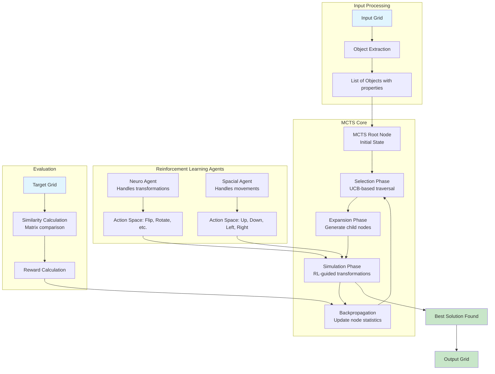

# ARC Prize 2025 – Neuro-Symbolic Solver

This project is focused on solving tasks from the [ARC (Abstraction and Reasoning Corpus)](https://github.com/fchollet/ARC) using a combination of **symbolic algorithms** (like A*, BFS, DSLs) and **neural models**, integrating them in a neuro-symbolic framework. The goal is to develop systems that generalize from few examples and mimic human-like reasoning.

## 🧠 Project Structure

| File | Description |
|------|-------------|
| `dsl.py`, `helper.py` | my dsl implementations & helper code |
| `arc_prize_soln.py`| Soln using Neural model combined with MCTS for task planning |
| `dl_models/neurosymbolic_reinforce.py` | Torch-based neural-symbolic integration |
| `dl_models/RL_A2C.py` | Torch-based neural-symbolic ,updatation using RL_A2C |
| `dl_models/q_learning.py` | Torch-based neural-symbolic ,updatation using q-learning (greedy-epsilon) |
| `Trash.py` | Scratch or deprecated experiments |
| `IDEAS.md` | Notes and brainstorming for models and approaches |
| `.gitignore` | Standard Git ignore rules |
| `README.md` | This file |

# **Architecture**

---

