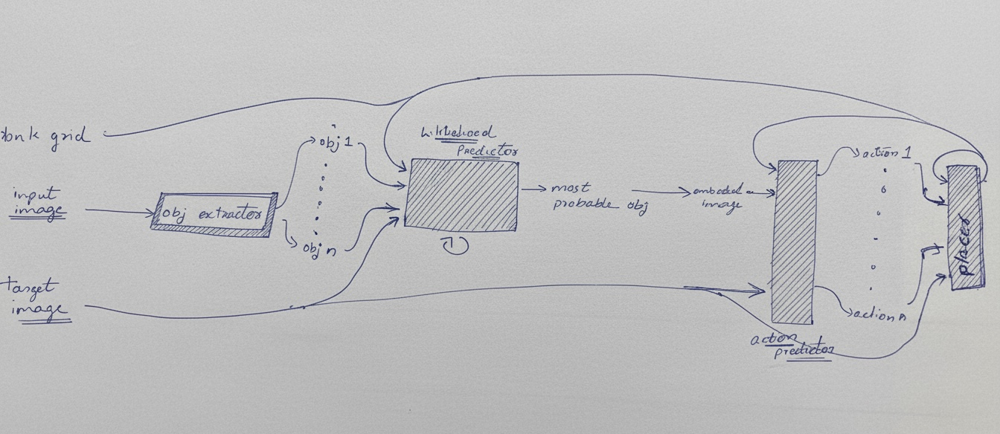

# ARC Prize 2025 – Neuro-Symbolic Solver

This project is focused on solving tasks from the [ARC (Abstraction and Reasoning Corpus)](https://github.com/fchollet/ARC) using a combination of **symbolic algorithms**  and **neural models**, integrating them in a neuro-symbolic framework. The goal is to develop systems that generalize from few examples and mimic human-like reasoning.

- For dataset & prediction visualization: https://arc-prize-visualizer.streamlit.app/

## 📂 File Structure

|Category|File / Directory|Description|
|---|---|---|
|**Core Logic & Execution**|`Arc_Prize_soln.py`|The main script that implements the core RL solution logic and generates outputs.|
||`Arc_Prize_pretraining.py`|Script for supervised pre-training machine learning models on ARC-like tasks.|
||`Arc_Prize_visualizer.py`|code to view prediction and datset using streamlite.|
||`d_models/`|A directory containing the dl models architecture and training code|
||`dsl.py`|Defines the custom Domain-Specific Language (DSL) for grid transformations.|
|**Helper Modules**|`helper.py`|A general-purpose module with utility functions used across the project.|
||`helper_arc.py`|Contains specific helper functions for handling ARC task data structures |
||`helper_env.py`|Contains specific helper functions  related to  the environment|
|**Data & Models**|`weights/`|Directory containing the saved weights for our trained models.|
||`generated_training_data.pkl`|A pickled file containing synthetically generated data used to train the models.|
|**Output & Logs**|`visualizations`|Default directory for storing the output visualizations|
||`app.log`|A log file for tracking main codes execution, debugging information, and errors.|
||`log`|A log folder for tracking subcodes execution, debugging information, and errors.|
|**Miscellaneous**|`IDEAS.md`|A document containing brainstorming notes and future ideas.|
||`.gitignore`|Specifies which files and directories to exclude from Git version control.|
||`arc-prize-2025/`|Directory  holding data to the 2025 ARC Prize.|
||`README.md`|This file.|

---

### **Visual Overview**
The described process is summarized in the following architecture diagram:

### **Objective**
This system is designed to iteratively transform an `input image` into a `target image` through a sequence of object-based arrangment . It uses a combination of CNN and reinforcement learning to intelligently select and manipulate objects over `n` steps.

### **Architecture & Process Flow**

The system operates in a loop, with each iteration performing the following steps:

1.  **Example Selection (Bandit Algorithm):**
    *   An `example_selector` module uses a bandit algorithm to choose the most informative demonstration example from a training task. The bandit algorithm dynamically prioritizes examples based on which ones are most effectively reaches the final solution

2.  **Object Extraction:**
    *   The **Object Extractor** analyzes the  `input grid` and identifies distinct objects using an iterative flood-fill algorithm.
    *   **Note:** To handle multi-colored objects, the algorithm first considers all colors. It then iteratively decreases the color used to merge adjacent regions, ensuring coherent objects are extracted even if they are not a single uniform color.

3.  **Likelihood Prediction (Focus Selection):**
    *   The **Likelihood Predictor** evaluates all extracted objects to determine which one to focus on in the current loop iteration.
    *   **Input:** It processes each object *sequentially*, along with the `target image` and the `current image`.
    *   **Output:** A probability distribution (`mask probability`) over the objects, identifying the one most critical to work on next. This design allows the system to handle an arbitrarily large number of objects.

4.  **Action Prediction:**
    *   The **Action Predictor** receives the selected object (as an `object image` and `object vector`) and decides what action to perform on it.
    *   **Output:** This module has a dual output:
        *   **Action Type:** A classification head predicting the action to take (e.g., `move`, `rotate`, `place`).
        *   **Position (x, y):** A regression head predicting coordinates. If the predicted action is `'place'`, this specifies the target location. The predictor also outputs a modified `object image` to allow for transformations (e.g., rotation, color change) before placement.

5.  **Object Placement:**
    *   The **Placer** module is a non-learned component that executes the action. It updates the `current image` by applying the predicted action (e.g., moving the object to the new (x, y) coordinates).
    *   **Note:** This is currently a deterministic module but is architected to be replaced by a learned model in the future.

This entire loop repeats for 'n' iterations, progressively refining the image toward the target.
the final output can be seen on `visualizations/train_outputs`

---

### **Training Approach**

*   **Pretraining:** The `Arc_prize_pretraining.py` script is used to pretrain the **Likelihood Predictor** and **Action Predictor** modules.
*   **Dataset:** Pretraining is performed on a synthetic dataset (`generated_training_data.pkl`), which contains examples of object transformations and their correct actions, allowing the predictors to learn fundamental manipulation skills before learning the full iterative policy .The visuals can be seen on `visualizations/data_loader` folder

### **Key Refinements and Notes**

*   **Iterative Refinement:** The core innovation is the closed-loop, iterative process where the output of one step (`current grid`) is the input to the next.
*   **Bandit-driven Curriculum:** The `example_selector` implements an intelligent, adaptive curriculum, which is a sophisticated alternative to random example selection.
*   **Scalability:** The sequential processing of objects makes the system scalable to complex scenes with many objects.
*   **Extensibility:** The modular design (e.g., the `Placer`) allows for individual components to be improved or replaced (e.g., with a deep learning model) without redesigning the entire system.