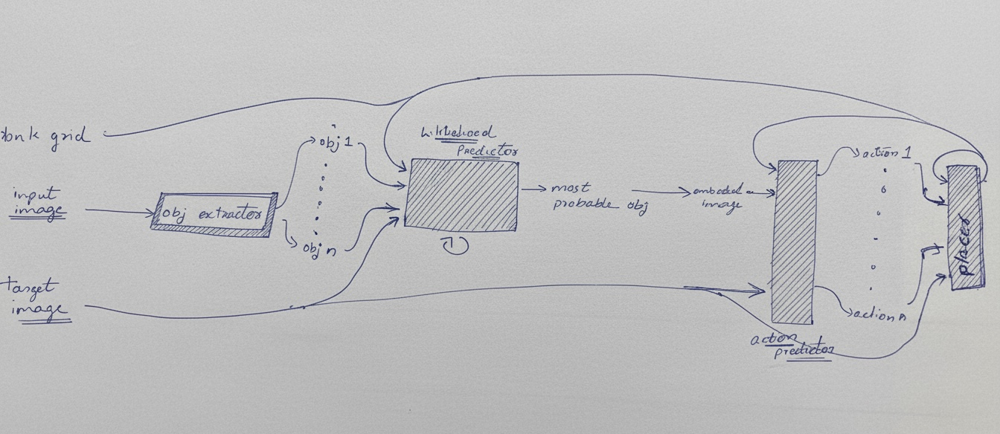

# ARC Prize 2025 – Neuro-Symbolic Solver

This project is focused on solving tasks from the [ARC (Abstraction and Reasoning Corpus)](https://github.com/fchollet/ARC) using a combination of **symbolic algorithms**  and **neural models**, integrating them in a neuro-symbolic framework. The goal is to develop systems that generalize from few examples and mimic human-like reasoning.

## 📂 File Structure

|Category|File / Directory|Description|
|---|---|---|
|**Core Logic & Execution**|`Arc_Prize_soln.py`|The main script that implements the core RL solution logic and generates outputs.|
||`Arc_Prize_pretraining.py`|Script for supervised pre-training machine learning models on ARC-like tasks.|
||`Arc_Prize_visualizer.py`|code to view prediction and datset using streamlite.|
||`d_models/`|A directory containing the dl models architecture and training code|
||`dsl.py`|Defines the custom Domain-Specific Language (DSL) for grid transformations.|
|**Helper Modules**|`helper.py`|A general-purpose module with utility functions used across the project.|
||`helper_arc.py`|Contains specific helper functions for handling ARC task data structures |
||`helper_env.py`|Contains specific helper functions  related to  the environment|
|**Data & Models**|`weights/`|Directory containing the saved weights for our trained models.|
||`generated_training_data.pkl`|A pickled file containing synthetically generated data used to train the models.|
|**Output & Logs**|`visualizations`|Default directory for storing the output visualizations|
||`app.log`|A log file for tracking main codes execution, debugging information, and errors.|
||`log`|A log folder for tracking subcodes execution, debugging information, and errors.|
|**Miscellaneous**|`IDEAS.md`|A document containing brainstorming notes and future ideas.|
||`.gitignore`|Specifies which files and directories to exclude from Git version control.|
||`arc-prize-2025/`|Directory  holding data to the 2025 ARC Prize.|
||`README.md`|This file.|

- for dataset & prediction visualization: https://arc-prize-visualizer.streamlit.app/

## architecture

 I use this in combination which with a `example_selector` which focus on which selects which example in the task to select based a bandit algorithm  (in which the example the score is improving )

 next it applies the architecture given below `n` no of times:
 

here liklihood predicts the object to focus on and the classifier focus on which dsl to apply

 
---

