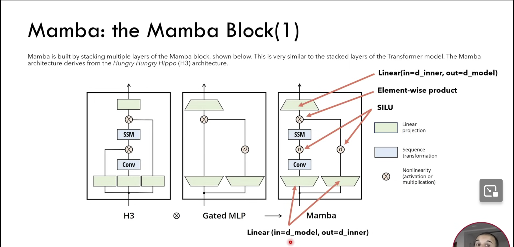
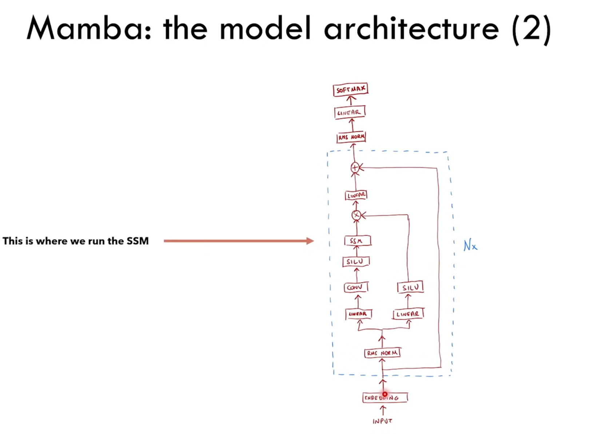

# current architecture of state space model

```
ARC Input Data ( input grid , target grid and current grid)
            │
            ▼
Input Tokenization/Embedding
            │
            ▼
       Mamba SSM Model         
                                
   +-------------------------+  
   |   Input Embedding       |  
   |   (if token-based)      |  
   +-------------------------+  
                │               
                ▼               
   +-------------------------+  
   |  Positional Encoding    |  
   |   (learnable)           |  
   +-------------------------+  
                │               
                ▼               
   +-------------------------+  
   |                         |  
   |  Mamba Blocks (×N)      |
   |                         | 
   +-------------------------+ 
                │              
                ▼              
   +-------------------------+ 
   |   Layer Normalization   | 
   +-------------------------+ 
                │              
                ▼              
+----------------------------------------+ 
|   Classification Head  + position head | 
+----------------------------------------+ 
                │              
                ▼                                     
    ARC Prediction Output          
                               
      

```


# current architecture of mamba block

```
Input Tensor: (batch_size, seq_len, d_model)
      │
      ▼
LayerNorm → in_proj → (batch_size, seq_len, 2 × d_inner)
      │
      ▼
Split into x_conv and x_ssm
      │
      ├───────────────────────────────────┐
      │                                   │
      ▼                                   ▼
x_conv: (batch_size, seq_len, d_inner)   x_ssm: (batch_size, seq_len, d_inner)
      │                                   │
      ▼                                   ▼
Conv1D → SiLU                            │
      │                                   │
      │              Generate Parameters:                  
      │              Δ = dt_proj(x_conv) → softplus
      │              B = B_proj(x_conv)
      │              C = C_proj(x_conv)
      │                                   │
      │                                   ▼
      │              Discretization:
      │              Ā = exp(Δ × A)
      │              B̄ = Δ × B
      │                                   │
      │                                   ▼
      │              Selective Scan:
      │              h_t = Ā × h_{t-1} + B̄ × x_t
      │              y_t = C × h_t + D × x_t
      │                                   │
      │                                   ▼
      │              Output: (batch_size, seq_len, d_inner)
      │                                   │
      └───────────────────┬───────────────┘
                          │
                          ▼
Element-wise multiplication: conv_output × ssm_output
                          │
                          ▼
out_proj → (batch_size, seq_len, d_model)
                          │
                          ▼
Add residual → Output: (batch_size, seq_len, d_model)
```


# default architecture of mamba



